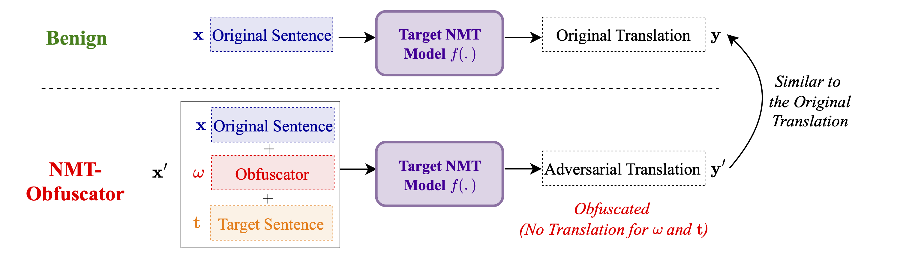

# NMT-Obfuscator Attack: Ignore a sentence in translation with only one word



This is the official repository of the paper [**"NMT-Obfuscator Attack: Ignore a sentence in translation with only one word"**](https://openreview.net/pdf?id=P7K39Wh5As). NMT-Obfuscator is an adversarial attack against NMT models. It has the ability to force the target NMT model to ignore and not to translate a target sentence which is appended to the original sentence with an obfuscator word. 

## Installation

To install the virtual environment with all the dependencies, run the following commands:

Install [conda](https://conda.io) and run the steps below:
```
$ git clone https://github.com/sssadrizadeh/NMT_Obfuscator.git
$ cd NMT_Obfuscator
$ conda create -n obfuscator python=3.9
$ conda activate obfuscator
$ pip install textattack
$ pip install evaluate
```

## How to use

To use the NMT-Obfuscator attack with an input sentence and a target sentence, run the following command:

```bash
python experiment_runner.py --input_sentence "Your input sentence" --target_sentence "Your target sentence" --attack_type "free" --model_name marian --src en --trg de
```

The results of the attack, together with timings, loss values and query count, will be logged in the file `results.log`.

To run the NMT-Obfuscator attack with the five target sentences from the paper, run the following command:

```bash
python3 experiment_runner.py --attack_type "target_length" --model_name marian --src en --trg de
```

The results of the attack for each target sentence will be found in seperate files in the `results` directory.


### Citation
If you found this repository helpful, please don't forget to cite our paper:
```BibTeX
@article{sadrizadeh2024nmt,
title={NMT-Obfuscator Attack: Ignore a sentence in translation with only one word},
author={Sahar Sadrizadeh, César Descalzo, Ljiljana Dolamic and Pascal Frossard},
booktitle={Neurips Safe Generative AI Workshop 2024}
url={https://openreview.net/pdf?id=P7K39Wh5As},
}
```
